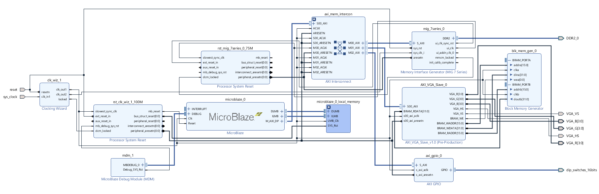

# FPGA Pong Game
[Video demo](https://www.youtube.com/watch?v=P2_haMc4vz4) (YouTube link)

This 2-player Pong game was programmed on a [Nexys A7-100T](https://store.digilentinc.com/nexys-a7-fpga-trainer-board-recommended-for-ece-curriculum/) using the MicroBlaze module programmed in Xilinx Vivado SDK (written in C), with other VHDL modules. All VHDL modules shown in the full block diagram are standard modules included with Vivado, except for the "AXI_VGA_Slave" module. The repo for that is also included.

The main logic for the game can be found in `pong_game.c`.

## Gameplay
Player inputs are taken from the on-board switches, and the output is displayed on a monitor through VGA. There are 4 game speeds, which can be changed at any time, and the game can be paused.

## Block diagram

  

